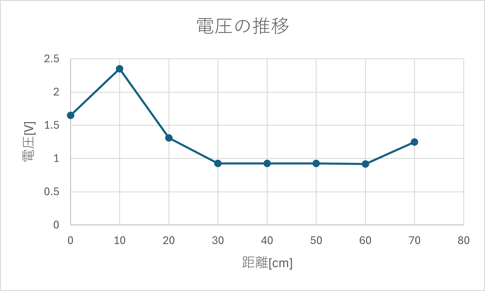
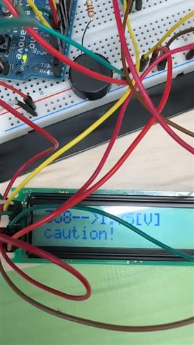

# #5 Techno-Crafts with Arduino
<div style="text-align: right;">
    4I24 中川 寛之
</div>  

## Purpose of the Experiment

The primary goal of this technical work is for participants to understand the fundamental principles of how electronic devices are developed.  
By using an Arduino microcontroller, the exercises aim to provide a hands-on experience in electronic control, demonstrating the relationship between hardware (inputs/outputs) and software (programs).

## Equipment Used
- PC
- Arduino
- Distancs Sensor
- LCD
- Buzzer
## Activities and Methods

### Assembling a Basic Buzzer Circuit

- **Method:**
    - A circuit was assembled connecting a buzzer and a resistor to a "digital No. 12 pin" (D12) on an Arduino Duemilanove board, which was fixed to a breadboard.
    - The Arduino was connected to a PC via a USB cable for power and programming.
    - A program was written in the Arduino IDE to make the buzzer turn on for 1000 ms and off for 1000 ms repeatedly, using a frequency of 440 Hz.
    - This was later modified to play a simple "Do-Re-Mi" scale by changing the frequency values in the code.

**Code**  
```c
#define BUZZER_PIN 12
void setup() {
}
void loop() {
    tone(BUZZER_PIN, 440) //La;
    delay(1000);
    noTone(BUZZER_PIN);
    delay(1000);
}
```

### Displaying Characters on a Liquid Crystal Display (LCD)

- **Method:**
    - The existing circuit was expanded by adding a 16x2 character LCD.
    - The LCD was wired to multiple digital pins on the Arduino (pins 2 through 7).
    - A new program was created that utilized the LiquidCrystal.h library to initialize the display and print a default message.
    - The program was designed to receive character data from the PC's "serial monitor" and display it on the LCD.

```c
#include <LiquidCrystal.h>
LiquidCrystal lcd(2, 3, 4, 5, 6, 7);
void setup() {
    lcd.begin(16, 2);
    lcd.print("Suzuka Kosen");
    Serial.begin(9600);
}
void loop() {
    if (Serial.available()) {
        delay(100);
        lcd.clear();
        while (Serial.available() > 0) {
            lcd.write(Serial.read());
        }
    }
}
```

**Result**  
.jpg>)

### Building a Distance Measuring Device (Rangefinder)

- **Method:**
    - **Sensor Characterization:**
        - The characteristics of an infrared distance sensor were investigated.
        - The sensor was powered by the Arduino's 5V and GND pins.
        - A digital multimeter was used to measure the sensor's analog output voltage (Vo) when an object was placed at specific distances, from 10 cm to 70 cm.
    - **Data Analysis:**
        - The collected voltage and distance data were plotted on a graph to establish their relationship.
        - This relationship was approximated by an inverse proportional equation, v = d / l, to convert voltage readings into distance.

    - **Arduino as a Voltmeter:**
        - The digital multimeter was removed, and the sensor's output (Vo) was connected to an analog input pin (A0) on the Arduino.
        - A program was written to read the analog value (0-1023) and convert it into a voltage (0-5V), displaying the result on the LCD.
    - **Rangefinder Creation:**
        - The program was modified to incorporate the previously derived equation (l = d / v) to convert the measured voltage into distance in centimeters, which was then displayed on the LCD.

        **found volue**  
        |cm	|[V]|
        |---|---|
        0	|1.65
        10	|2.35
        20	|1.31
        30	|0.926
        40	|0.925
        50	|0.928
        60	|0.92
        70	|1.25  

        **graph**
        
    - **Adding an Alarm Function:**
        - As a final step, conditional logic (if statements) was added to the program.
        - This made the buzzer sound an alarm (e.g., at 880 Hz) if the measured distance fell below a specified threshold, such as 30 cm.
        - Further application examples suggested changing the alarm's frequency or displaying a "caution!"

**Code**
```c
#include <LiquidCrystal.h>
 
#define BUZZER_PIN 12
#define PSD_PIN 0
 
LiquidCrystal lcd(2,3,4,5,6,7);
 
void setup(){
  lcd.begin(16,2);
}
 
void loop(){
  int a,l;
  float v;
 
  a = analogRead(PSD_PIN);
  v = (5.0/1024.0)*a;
  l = 28.0/v;
 
 
  lcd.clear();
  lcd.print(a);
  lcd.print("-->");
  lcd.print(v);
  lcd.print("[V]");
  lcd.setCursor(0, 1);
  if(l<30&&l>12){
    lcd.setCursor(0, 1);
    lcd.print("caution!");
 
    tone(BUZZER_PIN,880);
 
  }
  if(l<11){
    lcd.print("OMG");
    tone(BUZZER_PIN,440);
  }  
  delay(200);
}
```

This code satisfies the following points:

1. It converts analog values to voltage.
1. The displayed text changes as the distance becomes closer.
1. It calculates distance using the inverse proportional relationship of voltage.
1. The displayed text changes as the distance changes.
1. The sound of the buzzer differs depending on the distance.

**Result**  

