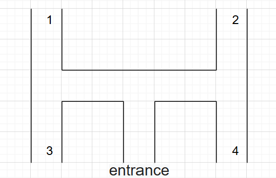
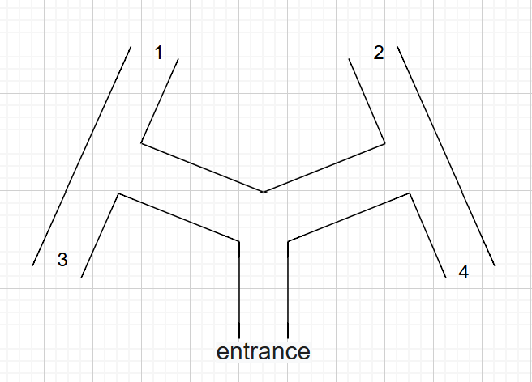
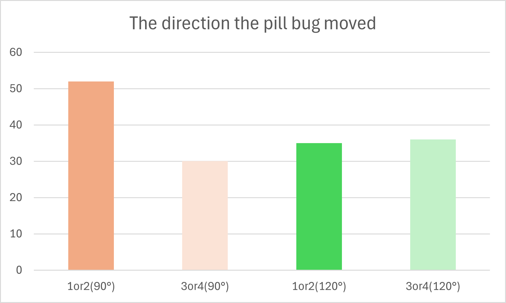
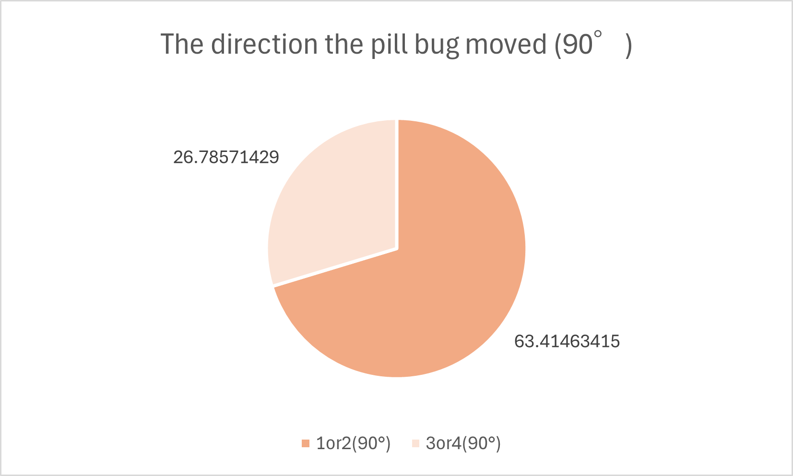
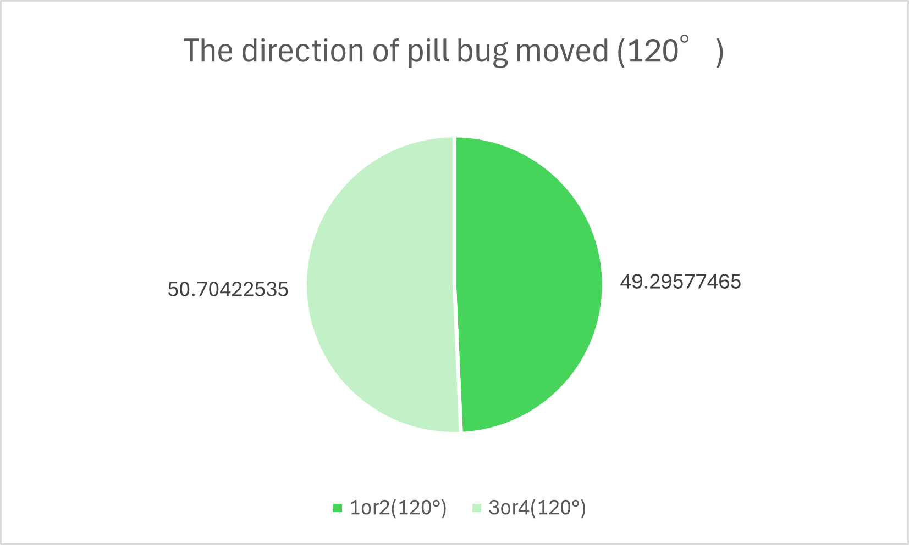

# #6 Turn alterations in pill bugs  

4I24 中川 寛之  

  

  
3M34 藤田 拓登  
3E41 山口 雄大  
3C31 藤井 英音  
4S11 岡田 紗季  

  

## 1. Purpose
- Observe the alternating turning behavior (turn alternation) in pill bugs

## 2. Background
- Verify the trait that if a pill bug turns right, it tends to turn left next

## 3. Method
- Use an H-shaped (*fig.1)
- Use a Y-shaped(120°)  (*fig.2)
- Release a set number of pill bugs and record which direction they turn
- Note number of bugs passing each route

    <*fig.1>  

    

    <*fig.2>
    

## 4. Results  

| 90° | 1or2 | 3or4 | Total | 120° | 1or2 | 3or4 | Total |
|---|---|---|---|---|---|---|---|
| Class 2 | 38 | 18 | 56 | Class 1 | 14 | 7 | 21 |
| Class 4 | 14 | 12 | 26 | Class 3 | 21 | 29 | 50 |
| Total | 52 | 30 | 82 | Total | 35 | 36 | 71 |
| Probability | 63.4146341 | 26.7857143 | | Probability | 49.2957746 | 50.7042254 | |
---

### 4-1 graph  

\<Comparison of Turn Directions Between 90° and 120° Mazes>
    
\<Pill Bug Movement Pattern (90° Angle)>
    
\<Pill Bug Movement Pattern (90° Angle)>
      
    
## 5. Discussion  

In the professor’s introduction, we heard that a turn alternation response was observed at a ratio of 9:1.  
However, in our actual experiment, only about 60% of the turn alternation response was observed.  
Possible reasons include the following:

- **Environmental factors related to the passage width**  
    The passage might have been too wide or too narrow, making the “stimulus from one side,” which triggers turning, rather ambiguous.

- **External factors due to pill bugs' aversion to light**  
    Because pill bugs exhibit negative phototaxis, the unstable light from either side might have caused them to prioritize avoiding light over turn alternation.  
    Similarly, in this experiment, LEGO blocks were used to construct the path, and the color differences of the blocks might have influenced their behavior.

- **Individual variation and stress factors**  
    Some pill bugs may have been stressed by handling or the experimental environment, which could have affected their natural turning behavior. Additionally, individual differences in size or age might have contributed to the variation in responses.

- **Timing and observation method**  
    The speed at which pill bugs moved through the maze and the timing of our observations might not have captured all turning behaviors accurately, especially if some bugs paused or moved very slowly at decision points.

## 6. Conclusion
As a result, although the ratio was not ideal, a turn alternation response was still observed.   
Personally, I found these experimental results very interesting and felt motivated to learn more about animal habits.  
 It is said that, when humans are undecided between right and left, they choose left 70% of the time. This experiment has given me a good opportunity to research that as well :)