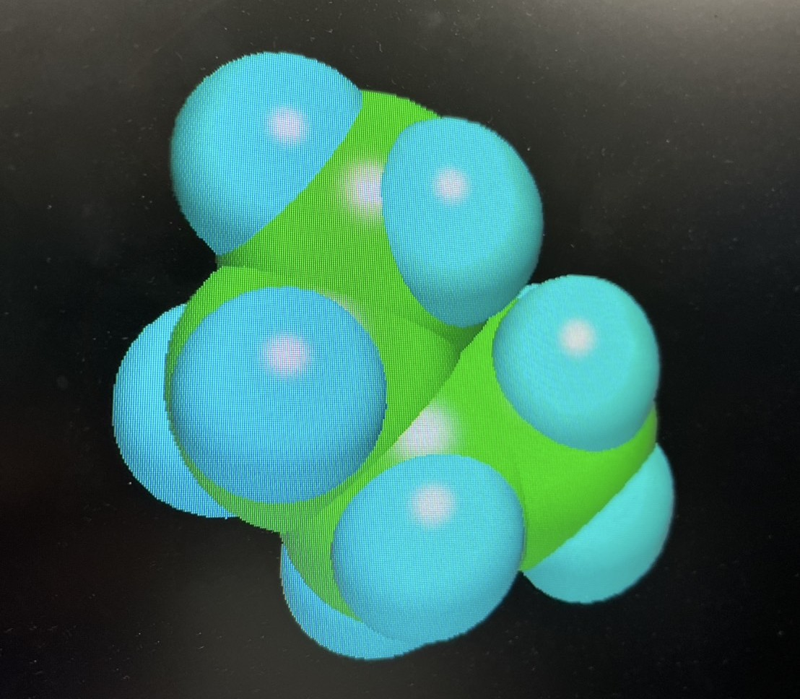
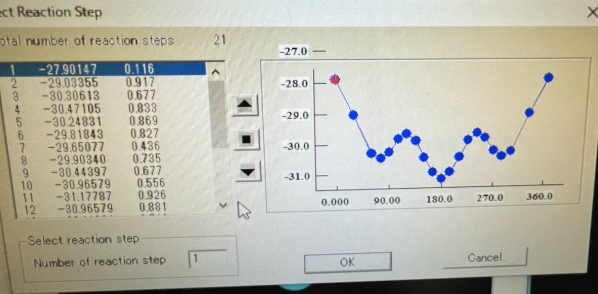

# Experimental Report: Construction of Conformational Energy Diagram of Butane

4I24 中川 寛之

  

## 1. Objective
In this experiment, we use a semi-empirical molecular orbital calculation program to calculate energy changes associated with the rotation of the central C2-C3 carbon-carbon bond in butane molecules and to construct a conformational energy diagram. The purpose is to learn about the relationship between the three-dimensional shapes (conformations) of molecules and their stability.

## 2. Background
Molecules can take different spatial forms by rotating around single bonds, even when the bonding between atoms remains the same. These different forms are called conformations, and isomers that can be converted to each other are called conformational isomers. Which conformation is stable is primarily determined by spatial collisions between atoms (steric hindrance).

n-Butane (CH₃CH₂CH₂CH₃) is considered a good example for learning the relationship between shape and stability because it exhibits several characteristic conformational isomers due to rotation around the central C2-C3 bond.

## 3. Experimental Method
The simulation was conducted using the computational chemistry software 'SCIGRESS MO Compact 1.0 Standard.'

1. Creation of butane molecule: We constructed a 3D model of butane in the software.

2. Initial structure optimization: We set the dihedral angle of the C2-C3 bond to 0 degrees and performed a calculation using the 'AM1' method to determine the structure with the highest energy state.

3. Energy calculation for bond rotation: We configured the calculation to determine the energy at various dihedral angles from 30 to 360 degrees and executed the calculation again.

4. Results verification: After the calculation was completed, we selected 'Properties' from the 'Reaction' menu to examine the graph (energy diagram) showing the relationship between the dihedral angle and the molecular energy.

## 4. Results
Following the above procedure, the energy (heat of formation) for each conformation was calculated by varying the dihedral angle of the C2-C3 bond in butane. The results were displayed as a graph with the dihedral angle on the horizontal axis and energy on the vertical axis, showing how the molecular stability changes periodically with bond rotation.

## 5. Discussion
Based on the calculation results, I observed that butane molecules have stable and unstable conformations depending on the dihedral angle of the C2-C3 bond.

Regarding the most stable conformation:
When the dihedral angle is 180°, the molecular energy reaches its lowest value, resulting in the most stable conformation. This is likely because the large atomic groups (methyl groups) at both ends of the molecule are positioned at their maximum distance from each other, minimizing steric hindrance between atoms.

Regarding the most unstable conformation:
Conversely, when the dihedral angle is 0°, the energy is highest, resulting in the most unstable conformation. In this form, the large atomic groups appear to overlap directly when viewed from the front, creating a very cramped arrangement. I believe this atomic collision is the main factor causing molecular instability.

Through this simulation, I was able to confirm that butane molecules are most stable when they adopt a relaxed conformation where the internal atomic groups experience minimal repulsion.

## 6. References
- procedure to open the output file.pdf

- Special Lecture of Engineering (June 30).pdf